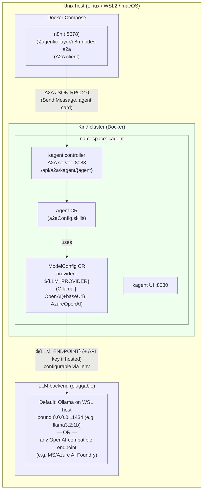

# Implementation Plan: n8n ⇄ kagent A2A Demo

## Problem Statement

Demonstrate that an **n8n agent workflow** can communicate with a **kagent-based
agent** over the **A2A (Agent-to-Agent) protocol**. The n8n workflow acts as the
**A2A client**; a kagent agent (running in Kubernetes) acts as the **A2A server**.
The kagent agent is powered by a **pluggable LLM backend**: the demo **starts with a
small local model on Ollama (WSL host)**, but the backend is configurable to **any
OpenAI-compatible endpoint** (e.g. Microsoft / Azure AI Foundry) by changing config
only — no code changes.

The whole environment must be reproducible on any **Unix-like host — Linux, WSL2, or
macOS** — via **idempotent, POSIX-portable scripts** and a small set of **Make
targets** that spin up and replay the demo. WSL2 is one supported target, not a hard
requirement; platform differences are handled by an OS-detection layer.

> Note: tasks below are designed to be executed one-at-a-time (Ralph-looped),
> not implemented in a single shot. Each task is independently verifiable.

## Validated Assumptions (from latest docs — June 2026)

| # | Assumption | Status | Source / Note |
|---|------------|--------|---------------|
| 1 | kagent natively exposes agents over A2A | ✅ Validated | A2A endpoint on controller port **8083**, path `/api/a2a/{namespace}/{agent}`; agent card served per agent |
| 2 | kagent supports a **pluggable LLM** incl. OpenAI-compatible | ✅ Validated in source | `ModelConfig` (`kagent.dev/v1alpha2`) `provider` ∈ {OpenAI, AzureOpenAI, Ollama, Anthropic, Gemini}; **`openAI.baseUrl` overrides the OpenAI base URL** → any OpenAI-compatible endpoint (e.g. MS/Azure Foundry); `ollama.host` for local |
| 3 | kagent installs via Helm OCI chart + CRDs | ✅ Validated | `oci://ghcr.io/kagent-dev/kagent/helm/kagent` and `.../kagent-crds`; also `kagent` CLI |
| 4 | n8n has an A2A **client** node | ✅ Validated | Community node `@agentic-layer/n8n-nodes-a2a` — "Send Message" op, JSON-RPC 2.0, **synchronous**, requires **n8n ≥ 1.60.0**, no auth yet |
| 5 | Agent-card discovery path | ✅ **Validated in source** | Both sides use `/.well-known/agent-card.json`; kagent (`a2a-go/v2 v2.3.1`) suffix-matches it under the agent route; n8n credential test hits `{serverUrl}/.well-known/agent-card.json`. Old `agent.json` was legacy. Only a runtime smoke test remains |
| 6 | n8n container (Docker Compose) can reach Kind-hosted kagent | ✅ **Mechanism validated** | Controller Service `ClusterIP:8083`, type overridable → `controller.service.type=NodePort` + Kind `extraPortMappings` + `a2aBaseUrl`; n8n reaches via `extra_hosts: host.docker.internal:host-gateway`. Only live connectivity confirmation remains |
| 7 | Smallest CPU tool-calling model | ⚠️ Verify at runtime | Default `llama3.2:1b` (supports tools); fallback `qwen2.5:1.5b`. Tiny models tool-call unreliably — validate the agent actually invokes skills |

## Environment Decisions (confirmed with user)

- **Dev env (baseline):** any **Unix-like host — Linux, WSL2, or macOS** (Intel or
  Apple Silicon). Scripts are POSIX-portable `bash` with a `uname`-based OS layer.
  Requires Docker (Engine on Linux/WSL2, Docker Desktop on macOS). Native Windows
  (non-WSL) is out of scope.
- **LLM backend:** **pluggable**. Default = small local model on **Ollama (host)**;
  swappable to **any OpenAI-compatible endpoint** (e.g. MS/Azure AI Foundry) via
  config only. Selected with `LLM_PROVIDER` in `.env`.
- **Kubernetes:** **Kind** (single cluster hosting kagent).
- **n8n:** **Docker Compose**.
- **A2A direction:** n8n workflow → kagent agent (n8n is client).

## Architecture



> **Note:** n8n never talks to the LLM directly — all inference happens inside the
> kagent agent. n8n only sends A2A requests to the kagent controller. The LLM is a
> kagent concern, selected entirely by the `ModelConfig` CR.

### LLM backend — pluggable, config-driven

The LLM is **not hard-wired to Ollama**. kagent reaches it via a single
`ModelConfig` CR (`kagent.dev/v1alpha2`), which the setup renders from `.env`:

| `.env` key | Meaning |
|------------|---------|
| `LLM_PROVIDER` | `ollama` (default) \| `openai` \| `azureOpenAI` |
| `LLM_MODEL` | model/deployment name (e.g. `llama3.2:1b`, `gpt-4o-mini`) |
| `LLM_ENDPOINT` | base URL / host (Ollama host **or** OpenAI-compatible `baseUrl` **or** Azure endpoint) |
| `LLM_API_KEY` | API key for hosted endpoints (stored as a k8s Secret; empty for Ollama) |

- **OpenAI-compatible endpoints (e.g. MS/Azure AI Foundry):** validated in the CRD —
  `provider: OpenAI` supports **`openAI.baseUrl`** ("Base URL for the OpenAI API
  (overrides default)"), plus a first-class `AzureOpenAI` provider
  (`azureEndpoint`/`azureDeployment`/`apiVersion`). Switching is a `.env` change +
  re-apply of the ModelConfig — no code changes.
- **Default = local Ollama (the only path needing host plumbing).** Bind Ollama with
  `OLLAMA_HOST=0.0.0.0:11434`; set `LLM_ENDPOINT` to an address routable from pods.
  **No CoreDNS patching** — `LLM_ENDPOINT` is injected straight into the ModelConfig.
  If unset for the `ollama` provider, the script auto-derives a **platform-aware**
  candidate set and probes each from an in-cluster pod, picking the first that works:
  - **Linux / WSL2 (Docker Engine):** the Kind docker-network gateway IP
    (`docker network inspect kind`, e.g. `172.18.0.1`) → pod→node→host.
  - **macOS / Docker Desktop:** the IP that `host.docker.internal` resolves to from a
    container (Docker Desktop routes it to the host VM), plus the bridge gateway.
  This keeps the same flow on every OS without per-machine edits.
- **Hosted providers need no host plumbing** — kagent pods just egress to the public
  `LLM_ENDPOINT` with the API-key Secret.
- **Verify, don't assume.** A throwaway in-cluster pod probes the resolved endpoint
  (Ollama: `GET /api/tags`; OpenAI-compatible: `GET /v1/models`) before install;
  fail fast with guidance on error.

n8n does not need the LLM; if a future flow ever did, the n8n container would reach
the same `LLM_ENDPOINT` (or `host.docker.internal` via
`extra_hosts: ["host.docker.internal:host-gateway"]` for a local Ollama).

**Request flow (demo replay):**
1. Trigger n8n workflow — either `make demo` (headless) or, for a live audience,
   click **Execute Workflow** in the n8n editor and watch the nodes run.
2. n8n A2A node discovers the kagent agent card, then sends a text message via JSON-RPC.
3. kagent controller routes to the Agent; the Agent calls the configured LLM backend (and/or its tools).
4. kagent returns the task result; n8n shows the response in the node's output panel
   (and `make demo` prints it to the terminal).

## Repository Layout (target)

```
kagent-n8n/
├── Makefile                      # top-level demo orchestration
├── README.md                     # how to run the demo
├── .env.example                  # shared config (LLM_PROVIDER/MODEL/ENDPOINT/API_KEY, ports, namespaces)
├── scripts/
│   ├── lib.sh                    # shared helpers + OS layer (uname; portable sed/grep)
│   ├── 00-preflight.sh           # detect OS/arch (Linux/WSL2/macOS); verify docker, resources
│   ├── 10-install-tools.sh       # kubectl, kind, helm, ollama via brew (macOS) / curl (Linux)
│   ├── 20-ollama-up.sh           # (ollama provider only) OLLAMA_HOST=0.0.0.0 serve + pull model
│   ├── 30-kind-up.sh             # create Kind cluster w/ port mappings
│   ├── 35-llm-config.sh          # resolve/verify LLM_ENDPOINT per provider (no CoreDNS)
│   ├── 40-kagent-install.sh      # CRDs + helm install kagent controller/UI
│   ├── 50-kagent-agent-apply.sh  # ModelConfig (templated by provider) + Agent CRs
│   ├── 60-n8n-up.sh              # docker compose up + install A2A node
│   ├── 70-import-workflow.sh     # import/activate n8n A2A workflow
│   ├── 90-demo-run.sh            # trigger workflow, print A2A response
│   └── 99-teardown.sh            # tear everything down
├── kind/
│   └── cluster.yaml              # Kind config w/ extraPortMappings (A2A :8083)
├── kagent/
│   ├── modelconfig.tmpl.yaml     # ModelConfig CR templated by provider (ollama/openai/azure)
│   └── agent.yaml                # Agent CR with a2aConfig.skills
├── n8n/
│   ├── docker-compose.yaml       # n8n service (+ community node env)
│   └── workflows/
│       └── a2a-demo.json         # n8n workflow using the A2A node
└── docs/
    └── troubleshooting.md        # agent-card path, networking, model tips
```

## Tasks (Ralph-loop units)

Each task is independently implementable and verifiable. Dependencies are tracked in SQL.
Check off each box (`[ ]` → `[x]`) as a task is completed so the Ralph loop knows what's done.

1. [x] **scaffold-repo** — Create directory layout, `.env.example`, `README` skeleton,
   `Makefile` stub with placeholder targets, `scripts/lib.sh` with idempotent
   helpers (`have_cmd`, `wait_for`, `log`) **and a `uname`-based OS layer**
   (`detect_os` → linux/wsl2/macos, `detect_arch`, portable `sed_inplace`/`grep`
   wrappers to avoid GNU-vs-BSD differences). *Verify:* `make help` lists targets;
   `lib.sh` sourced on Linux and macOS reports the correct OS/arch.

2. [ ] **preflight** — `00-preflight.sh`: **detect OS/arch** (Linux, WSL2, macOS;
   Intel/Apple Silicon) and assert the right runtime (Docker Engine on Linux/WSL2,
   Docker Desktop running on macOS), enough RAM/CPU, and required commands present
   (or installable). Refuse native Windows (non-WSL). Idempotent, exits 0 cleanly.
   *Verify:* re-running produces no errors/changes on both Linux and macOS.

3. [ ] **install-tools** — `10-install-tools.sh`: idempotently install pinned
   `kubectl`, `kind`, `helm`, and (for the ollama provider) `ollama`, choosing the
   installer per OS — **Homebrew on macOS, curl/apt on Linux/WSL2** — and the right
   CPU arch. Skip if already present at desired version. *Verify:* versions print on
   both platforms; re-run is a no-op.

4. [ ] **ollama-up** — `20-ollama-up.sh` (**runs only when `LLM_PROVIDER=ollama`**;
   no-op for hosted providers): start `ollama serve` with
   **`OLLAMA_HOST=0.0.0.0:11434`** (so Kind pods can reach it, not just loopback) and
   pull `LLM_MODEL` once. Use the OS-appropriate way to launch/keep it running.
   *Verify:* `curl :11434/api/tags` lists the model; listener on `0.0.0.0`; re-run
   does not re-pull.

5. [ ] **kind-up** — `30-kind-up.sh` + `kind/cluster.yaml`: create Kind cluster (named)
   with `extraPortMappings` exposing the kagent A2A NodePort to the host. Skip if the
   cluster already exists. *Verify:* `kubectl get nodes` Ready; re-run is a no-op.

6. [ ] **llm-config** — `35-llm-config.sh`: resolve the **provider-agnostic** LLM
   config from `.env` (`LLM_PROVIDER`, `LLM_MODEL`, `LLM_ENDPOINT`, `LLM_API_KEY`),
   no CoreDNS. For `ollama`: if `LLM_ENDPOINT` unset, auto-derive a **platform-aware
   candidate set** (Linux/WSL2: Kind docker-network gateway IP via `docker network
   inspect kind`; macOS/Docker Desktop: the `host.docker.internal` host IP + bridge
   gateway), **probe each from an in-cluster pod**, pick the first that reaches
   Ollama `:11434`, and write it back to `.env`. For `openai`/`azureOpenAI`: use the
   given base URL/endpoint as-is. **Verify** from a throwaway pod (Ollama:
   `GET /api/tags`; OpenAI-compatible: `GET /v1/models`, with the API key); fail fast
   on error. *Verify:* resolved values in `.env` and a test pod reaches the endpoint
   on Linux and macOS; re-run is idempotent.

7. [ ] **kagent-install** — `40-kagent-install.sh`: install `kagent-crds` + `kagent`
   Helm OCI charts (controller + UI). Set `controller.service.type=NodePort` (fixed
   nodePort) and `a2aBaseUrl` to the host-reachable URL so the agent card `url` is
   correct. The LLM is **not** wired here — it's applied as a provider-agnostic
   `ModelConfig` in the next task. Wait for controller/UI rollout. *Verify:* pods
   Ready; A2A NodePort reachable from the host; re-run upgrades idempotently.

8. [ ] **kagent-agent** — `50-kagent-agent-apply.sh` + `kagent/modelconfig.tmpl.yaml`
   + `kagent/agent.yaml`: render a **provider-agnostic `ModelConfig`** from `.env`
   (`provider`/`model` + `ollama.host` **or** `openAI.baseUrl` **or** `azureOpenAI.*`),
   create the API-key `Secret` when `LLM_API_KEY` is set, then apply the `Agent` CR
   (with `a2aConfig.skills`) referencing that ModelConfig. *Verify:* `kubectl get
   agent` Ready; agent card retrievable from the A2A endpoint
   (`curl .../.well-known/agent-card.json`).

9. [ ] **verify-a2a-endpoint** — Runtime smoke test (path & wire shape already validated
   in source, see findings). Confirm the live agent card is served at
   `{agentURL}/.well-known/agent-card.json` and a raw `curl` JSON-RPC `message/send`
   (no version header → legacy v0) returns a response. *Verify:* a manual `curl`
   round-trip returns an agent answer.

10. [ ] **n8n-up** — `60-n8n-up.sh` + `n8n/docker-compose.yaml`: bring up n8n (pinned
   ≥1.60.0) with the `@agentic-layer/n8n-nodes-a2a` community node installed and
   `extra_hosts: ["host.docker.internal:host-gateway"]` so it can reach the
   Kind-published A2A NodePort on the WSL host. *Verify:* n8n UI loads; A2A node
   appears; `host.docker.internal:<nodePort>` reachable from inside the container;
   re-run is idempotent.

11. [ ] **n8n-workflow** — `n8n/workflows/a2a-demo.json` + `70-import-workflow.sh`:
    a **visually presentable** workflow built for live demoing in the n8n editor —
    a Manual Trigger → A2A "Send Message" node → a Set/NoOp node that surfaces the
    response, with clearly labeled nodes, a sticky-note title, and a clean
    left-to-right layout on the canvas. Configures A2A credentials (kagent agent
    URL = `host.docker.internal:<nodePort>/api/a2a/kagent/<agent>`). Import +
    activate idempotently. *Verify:* opening n8n shows the workflow laid out on the
    canvas; it runs from the editor's "Execute Workflow" button.

12. [ ] **demo-run** — `90-demo-run.sh`: headless replay path — trigger the workflow
    (CLI/webhook), capture and pretty-print the A2A response proving n8n↔kagent
    communication. *Verify:* script prints a model-generated answer from the kagent agent.

13. [ ] **ui-demo** — `make open-ui` target + `docs` walkthrough: open the n8n editor
    directly on the imported workflow so the customer can **visually watch** the
    A2A node execute live (node turns green, execution badges appear) and read the
    kagent agent's reply in the node's output panel. Optionally open the kagent UI
    (`:8080`) side-by-side to show the agent receiving the call. *Verify:* the
    printed URL opens the workflow; a manual "Execute Workflow" click animates the
    nodes and shows the agent response in the output panel.

14. [ ] **make-orchestration** — Flesh out `Makefile`: `make up` (full idempotent
    bring-up in order), `make demo` (headless replay), `make open-ui` (visual
    demo), `make status`, `make logs`, `make down` (teardown), `make help`.
    *Verify:* `make up && make demo` works end-to-end; second `make up` is a no-op.

15. [ ] **teardown** — `99-teardown.sh`: delete Kind cluster, stop Compose, optionally
    stop Ollama / remove model. Idempotent. *Verify:* re-run cleanly with nothing left.

16. [ ] **docs** — `README.md` (prereqs, quickstart, the Make commands, architecture
   diagram, and a **"Live demo walkthrough"** section with the UI steps and what to
   point at) + `docs/troubleshooting.md` (**per-OS** networking between
   Compose↔Kind↔host LLM on Linux/WSL2/macOS, small-model tool-calling caveats).
   *Verify:* a fresh reader can run and visually demo from the README alone.

## Key Risks & Mitigations

- **Tiny local model can't tool-call reliably (default Ollama path):** default
  `llama3.2:1b`; if the agent fails to invoke skills, bump to `qwen2.5:1.5b` (still
  small) via `LLM_MODEL` in `.env`. Hosted OpenAI-compatible backends (e.g. MS/Azure
  Foundry) avoid this entirely — selected by `LLM_PROVIDER`.
- **Idempotency:** every script guards with existence checks and `wait_for`
  helpers; Make targets are safe to re-run.
- **Cross-platform portability (Linux/WSL2/macOS):** a `uname`-based OS layer in
  `lib.sh` isolates differences (installers via brew vs curl, GNU vs BSD
  `sed`/`grep`, host-IP derivation). The probe-verified `LLM_ENDPOINT` means
  pod→host reachability is confirmed per machine rather than assumed. Docker Desktop
  on macOS vs Docker Engine on Linux is the main variance; both are covered. Native
  Windows (non-WSL) is explicitly unsupported.

## Out of Scope

- Authentication on the A2A channel (n8n node does not support it yet).
- Streaming / long-running task polling (node is synchronous MVP).
- kagent → n8n (reverse) direction; bidirectional flows.
- Production hardening, ingress/TLS, multi-node clusters.
