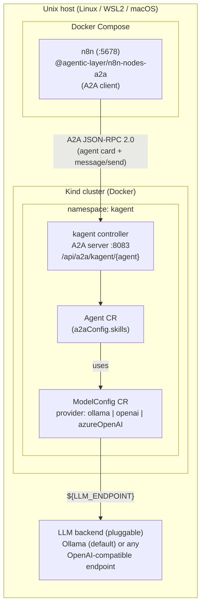

# kagent-n8n A2A demo

Demonstrates an **n8n agent workflow** talking to a **kagent-based agent** over the
**A2A (Agent-to-Agent) protocol**. n8n is the A2A *client*; a kagent agent running in
a Kind Kubernetes cluster is the A2A *server*. The agent is powered by a **pluggable
LLM backend** — a small local model on Ollama by default, swappable to any
OpenAI-compatible endpoint by config only.

> Full design, architecture diagram and task breakdown live in
> [`IMPLEMENTATION_PLAN.md`](./IMPLEMENTATION_PLAN.md).

## Prerequisites

- A Unix-like host: **Linux, WSL2, or macOS** (Intel or Apple Silicon).
- **Docker** (Engine on Linux/WSL2, Docker Desktop on macOS) running.
- `make`, `bash`, `curl`. Remaining tools (`kubectl`, `kind`, `helm`, `ollama`) are
  installed idempotently by `make tools`.

> **WSL2 + Docker Desktop users:** the IPv4-only Kind pods can't reach a stock
> dual-stack Ollama through WSL2's default NAT-mode mirror. `make up` fixes this by
> binding Ollama to IPv4 (`OLLAMA_HOST=127.0.0.1:11434` via a systemd drop-in,
> prompting for `sudo` once). A no-Ollama-change alternative is WSL mirrored
> networking. See
> [docs/troubleshooting.md](docs/troubleshooting.md#-docker-desktop--wsl2-gotcha-important-stock-ollama-is-dual-stack).

## Quickstart

```bash
cp .env.example .env      # optional; scripts auto-create .env on first run
make up                   # idempotent end-to-end bring-up
make demo                 # headless: trigger the workflow, print the A2A reply
make open-ui              # visual: open the n8n editor to run it live
make down                 # tear everything down
```

Run `make help` to list all targets.

## Configuration

All configuration lives in `.env` (created from `.env.example`). Key knobs:

| Key | Purpose |
|-----|---------|
| `LLM_PROVIDER` | `ollama` (default) \| `openai` \| `azureOpenAI` |
| `LLM_MODEL` | model / deployment name (default `qwen2.5:1.5b`) |
| `LLM_ENDPOINT` | LLM base URL/host (blank = auto-derive for ollama) |
| `LLM_API_KEY` | API key for hosted providers (blank for ollama) |

### Swapping the LLM backend

The LLM is a **kagent concern only** — n8n never talks to it. Switching backends is
a `.env` change plus a re-apply (`make kagent-agent`), with **no code changes**:

- **Local Ollama (default):** `LLM_PROVIDER=ollama`, `LLM_MODEL=qwen2.5:1.5b`. Leave
  `LLM_ENDPOINT` blank to auto-derive a pod-reachable host endpoint.
- **Any OpenAI-compatible endpoint (e.g. Azure / MS AI Foundry):**
  `LLM_PROVIDER=openai` (or `azureOpenAI`), set `LLM_ENDPOINT` to the base URL and
  `LLM_API_KEY` to the key. kagent's `ModelConfig` `openAI.baseUrl` overrides the
  default OpenAI URL so the pods egress straight to your endpoint.

## Architecture

n8n (A2A client, in Docker Compose) sends JSON-RPC `message/send` to the kagent
controller (A2A server, in a Kind cluster). The controller routes to the `Agent` CR,
which calls the LLM selected by its `ModelConfig` CR. The response flows back to n8n.



The A2A endpoint is published to the host on `KAGENT_A2A_NODEPORT` (default `30883`)
via a Kind `extraPortMapping`. The n8n container reaches it through
`host.docker.internal` (`extra_hosts: host.docker.internal:host-gateway`):

```
http://host.docker.internal:30883/api/a2a/kagent/a2a-demo-agent
```

## Make targets

| Target | What it does |
|--------|--------------|
| `make up` | Full idempotent bring-up (preflight → tools → ollama → kind → llm-config → kagent → agent → verify → n8n → workflow) |
| `make demo` | Headless: trigger the workflow and pretty-print the kagent A2A reply |
| `make open-ui` | Open the n8n editor on the imported workflow for a live, visual run |
| `make status` | One-glance status of host, Ollama, Kind, kagent and n8n |
| `make logs` | Tail kagent controller, agent, and n8n logs |
| `make down` | Tear everything down |
| `make help` | List all targets (incl. the granular per-step ones) |

## Live demo walkthrough

1. `make up` — brings the whole stack up idempotently (safe to re-run).
2. `make open-ui` — opens `http://localhost:5678/workflow/a2a-demo` in the editor
   and prints the demo login. n8n requires a login (it can't be disabled), but the
   owner account is **auto-provisioned** during `make up`, so you skip the "Set up
   owner account" wizard and the "Customize n8n to you" personalization popup, and
   just sign in with the documented demo credentials:
   - email: `demo@example.com`
   - password: `DemoPassw0rd`

   Override these via `N8N_OWNER_EMAIL` / `N8N_OWNER_PASSWORD` in `.env`.
3. Click **Execute Workflow**. Watch the **A2A Send Message** node turn green.
4. Open the **A2A Response** node's output panel: `agentReply` shows the kagent
   agent's sentence and `a2aStatus` shows `completed` — proof the A2A round-trip
   worked end-to-end.
5. Prefer a terminal? `make demo` does the same headlessly and prints the reply.

See [`docs/troubleshooting.md`](./docs/troubleshooting.md) for networking notes
(Compose ↔ Kind ↔ host LLM per OS) and small-model caveats.

## License

Released under the [MIT License](./LICENSE).
